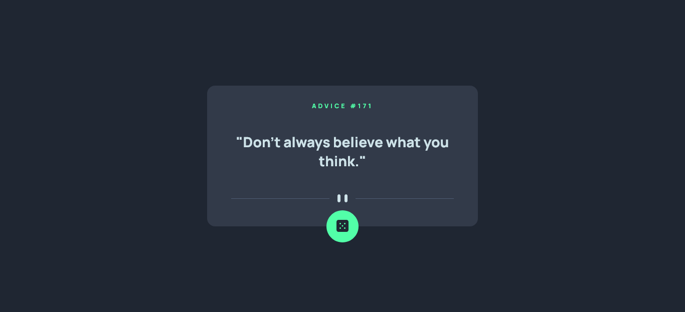

# Frontend Mentor - Advice generator app solution

This is a solution to the [Advice generator app challenge on Frontend Mentor](https://www.frontendmentor.io/challenges/advice-generator-app-QdUG-13db). Frontend Mentor challenges help you improve your coding skills by building realistic projects.

## Table of contents

- [Overview](#overview)
  - [The challenge](#the-challenge)
  - [Screenshot](#final-design)
- [My process](#my-process)
  - [Built with](#built-with)
  - [What I learned](#what-i-learned)

## Overview

### The challenge

Users should be able to:

- View the optimal layout for the app depending on their device's screen size
- See hover states for all interactive elements on the page
- Generate a new piece of advice by clicking the dice icon

### Final Design

### Links

- Solution URL: [Github Repo](https://github.com/Adnan-M03/advice-generator-app-main-)

### Built with

- Semantic HTML5 markup
- CSS custom properties
- Mobile-first workflow

### What I learned

I learned how to make the UI interact with the user while the async js is running.

## Author

- LinkedIn - [Adnan Mohammed](www.linkedin.com/in/adnan-mohammed-765015304)
- Twitter - [@DevByAdnan](https://x.com/DevByAdnan)
